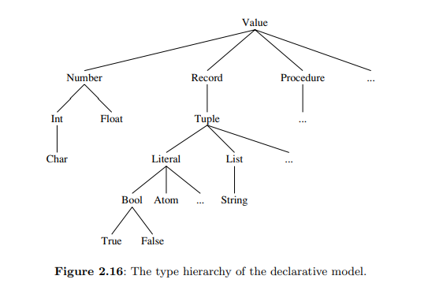

# Values and Types in the Declarative Model

## Core Concepts

* **Dynamic Typing:** Oz is a dynamically typed language, meaning a variable's type is only known at runtime when it is bound to a value.
* **Type Safety:** The system performs runtime checks to ensure operations use values of the correct type. This prevents programs from crashing due to internal data structure errors.
* **Error Handling:** In the simple declarative model, type errors cause immediate program termination. The concept of **exceptions** is introduced later to allow for in-model error handling.
* **Abstract Data Types (ADTs):** Programmers can define their own custom types beyond the basic types provided by the language.

## The Type Hierarchy

The basic types are structured in a hierarchy based on **set inclusion**. This implies that any operation valid for a parent type is also valid for a subtype. For example, all `lists` are a type of `tuple`, and all `tuples` are a type of `record`.

Here is another way to format the code. You can copy this and try pasting it directly into your markdown file. If the markdown preview doesn't show the graph, it might be an issue with the markdown viewer's support for Mermaid.

## Basic Types

### Numbers

* Can be `int` (integers) or `float` (floating-point numbers).
* The minus sign is written with a tilde `~`.
* **Examples:** `314`, `0`, `~10`, `1.0`, `3.4`, `2.0e2`, `~2.0E~2`.

### Atoms

* Symbolic constants.
* Written as a lowercase letter followed by alphanumeric characters, or any sequence of printable characters in single quotes.
* **Examples:** `a_person`, `donkeyKong3`, `'#### hello ####'`.
* An atom is a record with no features.

### Booleans

* The symbolic constants `true` and `false`.

### Records

* A compound data structure with a **label** (a `literal`) and key-value pairs (called `features`).
* **Features** can be atoms, integers, or booleans.
* **Examples:** `person(age:X1 name:X2)`, `person(1:X1 2:X2)`, `nil`, `person`.

### Tuples

* A specialized kind of record where the features are consecutive integers starting from 1.
* The features can be omitted in the syntax.
* **Example:** `person(1:X1 2:X2)` is equivalent to `person(X1 X2)`.

### Lists

* A recursive structure that is either
